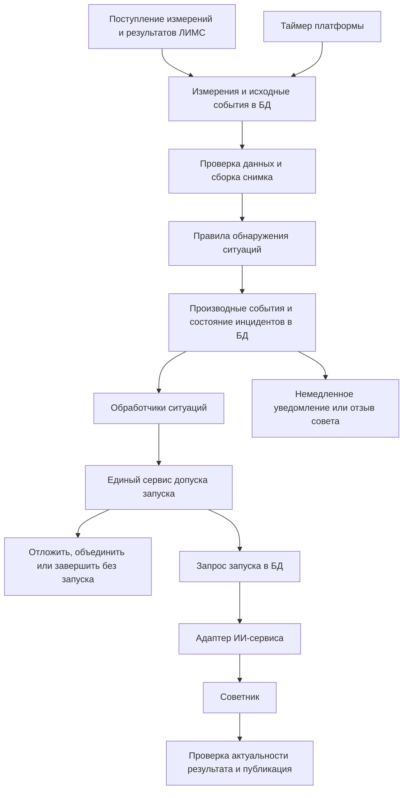

# События запуска советника для установки 24-2000

Дата: 22 сентября 2026 года. Статус: предложение архитектуры и план реализации для хакатона. Код платформы в рамках этой сводки не изменён.

Основной контур предлагаем строить вокруг установки гидроочистки 24-2000: платформа обнаруживает риск нарушения качества, сохраняет событие в базе и через единый сервис принимает решение о запуске советника. Данные АВТ, установки подготовки дизельной фракции, используются как дополнительные признаки изменения сырья. В спокойном режиме платформа проверяет состояние без обязательного запуска агента.

«Искусственные события» далее называются **производными событиями**: это результаты проверок реальных данных, например «сера вошла в зону предупреждения». Они хранятся отдельно от измерений. Придуманные показания температуры или серы в таблицу датчиков для этого не нужны.

## 1. Основания и границы решения

### Подтверждено материалами проекта

| Основание | Что следует для событий | Источник |
|---|---|---|
| Норма по сере составляет не более 10 мг/кг. | Ровно 10 мг/кг ещё соответствует норме; превышением считаем значение больше 10. Единица — мг/кг, а не просто мг. | «Разбор задачи», раздел 1; «Ответы на вопросы». |
| В спецификации приведено 1462 лабораторных определения серы продукта; в половине из них содержание серы не больше 8,6 мг/кг. | Фокус на 24-2000 обоснован близостью качества продукта к ограничению. Это не сравнение двух установок по одинаковому показателю: сырьё АВТ ещё не прошло очистку. | «Спецификация данных», разделы 6 и 9. |
| Телеметрия и ПАК имеют шаг 10 минут. ПАК — поточный анализатор качества; ЛИМС — система результатов лабораторных анализов. | После каждого нового интервала данных можно выполнять дешёвые проверки. Агенту не нужно обрабатывать каждое отдельное измерение. | «Спецификация данных», разделы 1 и 10. |
| Лабораторный результат на истории доступен через 4 часа после отбора пробы. | Время отбора и время доступности результата должны храниться раздельно. | «Ответы на вопросы», пункт 2.1; настройка агрегатора `AGGREGATOR_LIMS_DELAY_MINUTES=240`. |
| Организаторы обозначили шаг рекомендаций от 15 минут до 1 часа и горизонт прогноза до 3 часов. | Регулярный пересмотр укладывается в этот диапазон. Внеочередные пересмотры — наше дополнение для существенного ухудшения. | «Ответы на вопросы», раздел 1. |
| Для серы готовой формулы ВАК нет. ВАК — виртуальный анализатор качества, который рассчитывает показатель по другим измерениям. | Прогноз риска по сере требует собственной проверенной модели. До её появления работают пороги и простые признаки роста с явно указанными ограничениями. | «Спецификация данных», раздел 11. |
| Заводские аварийные пределы температуры, давления и подачи газа в рассмотренных материалах не установлены. | Исторические значения, например около 380 °C для температуры, не становятся аварийными уставками. | «Спецификация данных», раздел 6; перечень Рамиля помечает пределы как предположения. |

Числа выше взяты из существующего анализа проекта; в этой работе статистика исходных выгрузок заново не рассчитывалась. Все интервалы, пороги предупреждения и приоритеты в следующих разделах являются предлагаемыми настройками, если прямо не указано иное.

### Что исправить в перечнях коллег

В перечне Рамиля правильно выделены прогноз риска, поправка ПАК по лаборатории, наблюдение после воздействия и отказ от лишних советов. В перечне Евгения правильно выделены регламентный такт, запрос человека и восстановление после перерыва. Для EDA, архитектуры обработки событий, этим поводам нужны отдельные правила обнаружения, хранения и допуска запуска.

Есть пять существенных уточнений. Новый лабораторный результат требует пересчёта состояния, но не обязательно полного запуска. Потеря данных прежде всего требует детерминированного сообщения и отзыва неподтверждённых рекомендаций. Одинаковые соседние показания сами по себе не доказывают зависание прибора. Изменение измеренной температуры не доказывает, что оператор изменил уставку. Наконец, ожидание технологического отклика после воздействия нельзя превращать в запрет анализировать состояние в течение двух часов.

## 2. Какие данные использовать

**Тег** — идентификатор измеряемого показателя. Ниже слева указано его технологическое обозначение, справа — существующий код в платформе. При реализации обработчиков следует использовать коды каталога, а не подписи графиков.

| Источник и назначение | Код платформы | Применение |
|---|---|---|
| ПАК: сера продукта 24-2000, `24-2000:Mg.Sulfur`. | `pack_24-2000:mg.sulfur` | Основной поток для текущей оценки серы, согласно существующему каталогу платформы. |
| 24-2000: `Q21`, сера продукта из телеметрии. | `ht_q21` | Отдельный дополнительный ряд. Переключение на него требует собственной проверки качества и поправки. |
| ЛИМС: гидроочистка, точка 2, сера продукта. | `lims_ht.2.mg.sulfur` | Проверка качества отобранной пробы и сопоставление ПАК с лабораторией. `L21` оставлен в коде как прежнее обозначение. |
| 24-2000: `Q20`, сера сырья. | `ht_q20` | Обнаружение изменения входного сырья. Норма 10 мг/кг к этому потоку не применяется. |
| ЛИМС: гидроочистка, точка 1, сера сырья. | `lims_ht.1.mass.sulfur` | Уточнение состава сырья. Массовые проценты переводятся в мг/кг: один процент соответствует 10 000 мг/кг. |
| 24-2000: `T6`, температура смеси на входе в Р-202; `T11`, температура на выходе. | `ht_t6`, `ht_t11` | Контроль изменения режима и проверка ограничений по каждому месту измерения. |
| 24-2000: `P13`, давление на входе; `P8`, перепад давления реактора. | `ht_p13`, `ht_p8` | Отдельные проверки давления и перепада; величины не взаимозаменяемы. |
| 24-2000: `F9`, массовый расход сырья. | `ht_f9` | Нагрузка установки и изменение подачи сырья. |
| 24-2000: `F25`, свежий водородсодержащий газ; `F2`, циркуляционный газ. | `ht_f25`, `ht_f2` | Контроль подачи газа и отношений расхода газа к расходу сырья. |
| 24-2000: `F14`, расход квенча — потока для охлаждения смеси в реакторе. | `ht_f14` | Дополнительный признак изменения режима; конкретный аварийный порог требует согласования. |
| 24-2000: `F17`, массовый выпуск; `F26`, объёмный выпуск. | `ht_f17`, `ht_f26` | Оценка выпуска и результата изменения режима. |
| ПАК: плотность продукта; ЛИМС: плотность продукта. | `pack_24-2000:d15`, `lims_ht.2.d15` | Дополнительное ограничение качества гидроочищенного топлива. |
| АВТ: `F30`, отбор тяжёлой дизельной фракции; лабораторные показатели сырья. | `avt_f30`, `lims_ht.1.95%.t`, `lims_ht.1.d15` | Предупреждение об изменении сырья. Задержка от АВТ до гидроочистки пока не установлена. |

Каталог платформы отдельно предупреждает, что ряды ПАК и `Q21` плохо совпадают. Поэтому нельзя незаметно склеить их, усреднить как независимые подтверждения или перенести поправку с одного ряда на другой. Выбранный источник и версия поправки входят в каждый снимок данных.

Отношения `F25/F9` и `F2/F9` характеризуют расход соответствующего газа на тонну сырья, а не количество чистого водорода. Для последнего нужна доля водорода в газе. Расходы свежего и циркуляционного газа нельзя без обоснования складывать. При нулевом или недостоверном `F9` отношения не рассчитываются.

До проверки порогов необходимо применить правила качества входов. Для двух телеметрических выгрузок код `307` означает недостоверное значение по спецификации проекта: он не должен становиться событием «сера 307 мг/кг». Это правило формата данных, а не универсальная физическая граница всех источников. Отрицательные расходы, пропуски, несовместимые единицы и недопустимые знаменатели исключаются из соответствующих расчётов; исходные записи сохраняются для аудита.

Обязательные входы определяются отдельно для каждого расчёта. Отсутствие `Q20` снижает возможности прогноза состава сырья, но не отменяет достоверного текущего превышения серы по ПАК. Отсутствие данных о температуре или подаче газа может запрещать конкретную рекомендацию по этим параметрам. Для модели ВАК, использующей лабораторное слагаемое, обязательно проверяются доступность и возраст именно этого слагаемого. Единый признак «все данные плохие» для установки слишком груб.

## 3. Как устроить событийный контур

**Снимок данных** — согласованный набор измерений, их времени, признаков достоверности и расчётных оценок, на котором принимается одно решение. **Инцидент** — продолжающаяся ситуация, например один эпизод повышенной серы. **Обработчик** — код платформы, подписанный на определённый тип события.



Источник публикует факт поступления данных. Детерминированные правила, то есть обычный код без языковой модели, определяют, что изменилось. Обработчик значимой ситуации подаёт заявку в единый сервис допуска. Только этот сервис разрешает автоматический запуск советника.

Следует различать три уровня событий:

| Уровень | Примеры | Обработчик |
|---|---|---|
| Поступили входные данные или наступило время. | `measurement.received`, `lab.result_available`, `telemetry.window_ready`, `timer.health_tick`. | Валидатор, сборщик снимка, пересчёт признаков. |
| Обнаружена значимая ситуация. | `quality.sulfur_warning_entered`, `feed.sulfur_shift_detected`, `data.critical_unavailable`. | Обновление инцидента, уведомление, запрос пересмотра. |
| Изменилось исполнение решения платформы. | `advisor.run_requested`, `advisor.run_deferred`, `advisor.run_started`, `advisor.run_completed`, `advisor.run_failed`. | Очередь запусков, адаптер ИИ-сервиса, контроль результата. |

`measurement.received` не запускает агента непосредственно. Новые события исполнения также не должны по общей подписке снова запускать советника: иначе получится цикл.

## 4. Каталог событий по данным

Приоритеты: **P0** требует немедленного уведомления и пересмотра; **P1** означает существенный риск качества; **P2** означает обычный пересмотр; **P3** означает необязательную оптимизацию. Приоритет события и необходимость вызова агента — разные свойства. Даже событие P0 может завершиться сообщением «данных для надёжной рекомендации недостаточно» без вызова модели.

Все условия ниже — предложения для реализации. Конкретные начальные числа вынесены в раздел 7, чтобы их можно было менять без переписывания обработчиков.

| № / событие | Когда формировать и какие данные нужны | Обработчик и результат | Приоритет и запуск |
|---|---|---|---|
| D01 `quality.sulfur_warning_entered` | Достоверная оценка серы продукта устойчиво вошла в зону предупреждения. Источник: выбранный ПАК с допустимой поправкой и оценкой неопределённости. | Открыть инцидент, обновить прогноз и предложить пересмотр режима защиты качества. | P1. Обычное ограничение частоты сохраняется, пока риск не стал срочным. |
| D02 `quality.sulfur_limit_exceeded` | Текущее достоверное измерение серы продукта больше 10 мг/кг. Если источник подозрителен, сформировать событие о неподтверждённом риске, а не утверждать факт превышения. | Сразу показать превышение по источнику; проверить лабораторию, прогноз и ограничения режима. Одно измерение требует проверки, но уведомление не ждёт окна предупреждения. | P0 для нового эпизода подтверждённого измерением превышения. Обход обычной паузы. |
| D03 `quality.sulfur_breach_predicted` | Проверенная модель прогнозирует превышение 10 мг/кг на горизонте до 3 часов. Хранить время ожидаемого нарушения и неопределённость. | Сравнить время до нарушения со временем получения совета, действий оператора и отклика процесса. | P1; P0, если окно предотвращения нарушения закрывается. Не ждать устойчивости D01, если прогноз уже срочный и достоверный. |
| D04 `quality.risk_escalated` | В открытом инциденте существенно сократилось время до нарушения, вырос прогнозируемый максимум серы либо возник новый подтверждающий факт. | Повысить ревизию инцидента, сделать прежний совет требующим пересмотра и запросить новый расчёт. | P0. Обход паузы и ожидания эффекта, если ухудшение существенное. |
| D05 `lab.product_result_available` | Пришёл новый доступный лабораторный результат точки 2, включая исправленную версию результата. | Сопоставить пробу с ПАК около времени её отбора, пересчитать поправку и текущее состояние. Несколько показателей одной пробы объединить. | Сам по себе запуск не нужен. Дочернее событие определяет приоритет. |
| D06 `lab.product_sulfur_exceeded` | Новая лабораторная проба содержит больше 10 мг/кг серы. | Зафиксировать подтверждённое нарушение на момент отбора. Срочно пересмотреть текущее состояние, если оно ещё не рассмотрено с учётом этого результата. | P0 при значимом новом свидетельстве. Поздняя старая проба не доказывает текущее превышение. |
| D07 `quality.analyzer_lab_mismatch` | Расхождение лаборатории и ПАК для сопоставимых времён превысило порог; учитываются качество совпадения и тип пробы. | Обновить доверие к источнику. Кандидат поправки проходит проверку; единственная необычная проба не должна бесконтрольно сдвигать всю оценку. | P1. Агент нужен только при изменении решения, риска либо необходимости выбрать действие при конфликтующих источниках. |
| D08 `feed.sulfur_shift_detected` | `ht_q20` устойчиво вырос относительно недавнего стабильного режима либо новый анализ сырья существенно изменил оценку серы. | Пересчитать нагрузку на гидроочистку и прогноз качества. Порог продукта 10 мг/кг здесь не использовать. | P1. Запуск, если изменился риск или актуальность совета. |
| D09 `feed.fraction_shift_detected` | Изменились отбор АВТ `F30`, температура выкипания 95 % сырья либо его плотность. Температура выкипания 95 % обозначается T95. | Сохранить вероятное изменение состава и неопределённость задержки. Не считать, что сырьё уже дошло до реактора. | P2; P1 при подтверждении входными данными 24-2000 или прогнозом риска. |
| D10 `process.gas_supply_degraded` | Устойчиво снизились `F25`, `F2` либо соответствующее отношение к `F9`; показания пригодны, установка работает. | Проверить совместно подачу сырья, газ, давление и качество; исключить варианты, требующие недоступного ресурса. | P1; P0 только при нарушении настроенного технологического ограничения или срочном риске качества. |
| D11 `process.feed_load_changed` | Расход сырья `F9` существенно изменился относительно устойчивого режима. | Пересчитать прогноз, выпуск и доступные действия. Снижение и увеличение подачи фиксировать раздельно в содержимом события. | P2; P1 при росте риска. Одновременно открыть наблюдение за эффектом. |
| D12 `process.operating_envelope_exceeded` | `T6`, `T11`, `P13`, `P8` либо другой согласованный показатель нарушил конкретный технологический предел. | Немедленно уведомить, отозвать несовместимые советы, запросить пересмотр только допустимых вариантов. | P0. Включать только при наличии конфигурации предела и его основания. |
| D13 `process.unusual_regime_detected` | Температура, давление, перепад или их скорость изменения вышли из области режимов, на которых проверены правила и модели. | Пометить снижение применимости модели. Для разности `T11−T6` учитывать, что это разные точки измерения, а не полный профиль температур реактора. | P1. Без заводских пределов называть ситуацию необычной, а не аварийной. |
| D14 `process.operating_point_changed` | Измерения `T6`, `F9`, `P13`, `F25` или `F2` устойчиво изменились; либо поступила явная запись о действии оператора. | Зарегистрировать возможное воздействие и окно наблюдения. Автор воздействия известен только из журнала действий, не из формы графика. | P2, обычно без нового агента. Ухудшение обрабатывается через D04. |
| D15 `data.critical_unavailable` | Нет свежих обязательных входов, пришёл служебный код, обнаружено невозможное значение либо подтверждено длительное зависание. | Сразу изменить статус доверия, отозвать советы, для которых данных недостаточно; показать причину. | P1; P0 для отзыва уже опасно неактуального совета. Полный агент по умолчанию не запускается. |
| D16 `data.validity_restored` | После сбоя накопилось достаточное окно свежих согласованных данных. Одной успешной записи недостаточно для проверки устойчивости. | Пересобрать снимок и пересчитать все активные правила; закрыть инцидент недоступности. | P2. Один запуск, если есть актуальный риск или требуется заменить отозванный совет. |
| D17 `quality.other_property_risk` | Плотность либо другой показатель нарушает ограничение выбранного продукта или прогнозирует его нарушение. | Использовать профиль требований к конкретному продукту и точке процесса. | P1. В первой версии достаточно плотности; остальные показатели добавлять по готовности моделей. |
| D18 `optimization.opportunity_detected` | Режим устойчив, существенных рисков нет, модель показывает значимый выигрыш выпуска или экономии при допустимом качестве. | Сформировать задачу режима «Производство» и сравнить альтернативы с сохранением текущего режима. | P3. Не запускать при активном риске, недостатке данных или неоценённом воздействии. |
| D19 `quality.risk_cleared` | Все причины инцидента перестали действовать и выполнено условие устойчивого выхода из риска. | Закрыть инцидент, отменить связанные отложенные заявки, обновить карточку состояния. | P2. Агент только если требуется пересмотреть действующий совет; закрытие само по себе обходится без модели. |
| D20 `context.constraints_changed` | Изменены требования к продукту, доступность газа, согласованные пределы, версия модели или политика доверия к источникам. | Пересчитать допустимость текущих советов и все затронутые правила. | P2; P0, если действующий совет стал недопустимым. Для внешних ограничений нужен новый источник данных или интерфейс. |

Для D17 по ответу организаторов от 17.09 плотность продукта гидроочистки должна находиться в пределах 820–845 кг/м³. Цетановое число для этой стадии не нормируется. Ограничения товарного летнего и зимнего топлива относятся к соответствующим профилям продукта; расчётный цетановый индекс нельзя выдавать за измеренное цетановое число. Полный контур смешения компонентов остаётся отдельным расширением: измерений по нему в пакете нет.

Советник по D12 помогает объяснить ситуацию и пересмотреть рекомендации. Немедленная индикация нарушения работает независимо от его времени ответа; автоматическое управление установкой этим проектом событий не предполагается.

## 5. События по времени и действиям пользователя

| № / событие | Условие | Реакция платформы и запуск |
|---|---|---|
| T01 `timer.review_due` | Наступил очередной срок пересмотра, начально каждые 30 минут технологического времени. | Пересчитать состояние. При неизменном нормальном режиме записать «действий не требуется» без агента. Если есть ещё не рассмотренные изменения, запросить P2 или приоритет активного риска. |
| T02 `timer.health_tick` | Каждую минуту технологического времени, даже если измерения вообще перестали поступать. | Проверить свежесть, сроки действия советов и просроченные задания. Сформировать D15, T03 или T04. Сам таймер агента не запускает. |
| T03 `recommendation.validity_expired` | Истёк срок действия опубликованной рекомендации. | Убрать статус актуальности. Запросить P2 при сохранении потребности и пригодном снимке; иначе сообщить причину отсутствия новой рекомендации. |
| T04 `action.effect_check_due` | После зарегистрированного воздействия наступило время оценки эффекта. | Сравнить фактическое изменение с ожидаемым, учитывая новое сырьё и помехи. При недостаточном эффекте и сохраняющемся риске запросить P1; при ухудшении — D04. |
| T05 `advisor.deferred_run_due` | Наступило сохранённое время допуска отложенной заявки. | Повторно проверить актуальность причин и собрать свежий снимок. Запустить либо отменить с причиной, не дожидаясь следующего входного измерения. |
| T06 `platform.recovered` | Платформа восстановилась после остановки либо воспроизведение продолжено с контрольной позиции. | Обработать недоставленные события, восстановить инциденты, объединить пропущенные такты в один актуальный пересмотр. Не запускать агента за каждый прошлый такт. |
| T07 `advisor.execution_timeout` / `advisor.run_failed` | Запуск завершился ошибкой либо превысил технический срок ожидания. | Сохранить ошибку, убрать статус «сейчас будет совет», выполнить ограниченный повтор того же запроса. При исчерпании повторов уведомить о недоступности. |
| U01 `operator.analysis_requested` | Пользователь задал вопрос в интерфейсе. | Создать `chat`-сессию по существующему API. Ответ относится к выбранному снимку; чат не сбрасывает автоматическую паузу и не подменяет опубликованную рекомендацию. |
| U02 `operator.reassessment_requested` | Пользователь явно запросил новый расчёт рекомендации. | Заявка через общий сервис с основанием `operator_request`. Может обходить обычную паузу, но сохраняет проверку данных, объединение повторов и ограничение одновременных запусков. |
| U03 `operator.action_recorded` | Пользователь отметил применение, отклонение или изменение предложенного действия. | Сохранить отдельный факт. Только применение с временем и параметрами открывает окно оценки эффекта; отклонение с причиной может потребовать пересмотра альтернатив. |

T03 и T04 принципиально различаются. Первый проверяет актуальность текста совета. Второй проверяет эффект действительно выполненного действия. Выдача совета без подтверждения применения не запускает отсчёт технологического отклика.

## 6. Единый сервис допуска запуска

Предлагаем назвать компонент `AdvisorLaunchService` и разместить в платформе. Его назначение — превратить несколько поводов в одно согласованное решение «запустить сейчас», «отложить», «объединить» или «не запускать». ИИ-сервис исполняет задачу, а платформе принадлежат политика частоты, приоритеты, текущие инциденты и решение о публикации результата.

### 6.1. Контракт заявки

Пример ниже описывает новый внутренний контракт платформы, а не существующий API:

```json
{
  "unit_id": "24-2000",
  "advisor_id": "process-advisor",
  "scenario_id": "demo-01",
  "trigger_event_ids": ["evt-101", "evt-102"],
  "incident_ids": ["incident-12"],
  "snapshot_id": "snapshot-740",
  "requested_priority": "P0",
  "mode": "protection",
  "bypass_cooldown": true,
  "bypass_reason": "risk_escalated",
  "not_before": "2026-07-12T09:20:00Z",
  "deadline_at": "2026-07-12T09:25:00Z",
  "policy_version": "launch-v1"
}
```

`bypass_cooldown` означает только обход обычного интервала между запусками. Значение проверяет сервис по типу события и его доказательствам. Любой обработчик не может самостоятельно назначить себе срочность без основания. `mode=protection` означает защиту качества, `mode=production` — поиск производственной возможности. Итоговый режим сервис определяет по всему текущему состоянию, а не только по заявке.

Допустимые причины обхода: новый эпизод достоверного превышения, существенное ухудшение открытого инцидента, закрывающееся окно предотвращения нарушения, нарушение согласованного предела, недопустимость действующего совета и явный запрос оператора. Обычное поступление лабораторного результата само по себе в этот список не входит.

Флаг не отменяет проверку достоверности, защиту от повторной доставки, ограничения оборудования, проверку актуальности ответа и правило одного активного автоматического советника на установку. Полный набор причин сохраняется в журнале, включая решение об отклонении обхода.

### 6.2. Частота и приоритеты

| Приоритет | Обычная политика | Что происходит во время паузы |
|---|---|---|
| P0 | Допуск сразу после минимальной проверки достоверности и актуальности. | Обычная пауза пропускается. Если агент занят, действуют правила прерывания ниже. |
| P1 | Не чаще одного обычного запуска за 15 минут на установку. | Причины объединяются в отложенную заявку. Если ожидание до следующего допуска делает предотвращение риска невозможным, приоритет повышается до P0. |
| P2 | Не чаще одного запуска за 30 минут. | Одна заявка ждёт следующего допуска и заново проверяется перед исполнением. |
| P3 | Не чаще одного запуска за 60 минут, только при отсутствии P0–P2 и блокирующих рисков. | Возможность пересчитывается перед запуском; устаревшая экономическая возможность отменяется. |

Это начальная политика команды, а не измеренная оптимальная частота. Общая точка отсчёта — начало последнего автоматического запуска для сочетания «сценарий, установка, советник». Так частоты разных обработчиков не складываются. Резервирование запуска и обновление этой отметки должны быть одной атомарной операцией. Срочный запуск тоже обновляет отметку; другой срочный эпизод при необходимости снова обходит паузу.

Отложенные заявки не теряются: у них есть `not_before`, конечный срок актуальности и сохранённые причины. Отмена из-за нормализации отличается от откладывания из-за частоты. Сервис возвращает структурированный результат, например `started`, `queued`, `coalesced`, `suppressed`, `blocked_data`, и ссылку на запись решения.

### 6.3. Если агент уже работает

Обычные события добавляются к одной ожидающей заявке с максимальным приоритетом и объединёнными причинами. Для независимых инцидентов сохраняются отдельные идентификаторы, даже если они рассматриваются одним запуском.

При P0 платформа немедленно сообщает о новом обстоятельстве и отмечает результат текущего запуска как требующий проверки актуальности. Если текущий запуск не успевает к сроку срочного пересмотра, адаптер запрашивает его прерывание. Новый запуск начинается после подтверждения остановки или завершения старого. В текущем ИИ-сервисе есть механизм прерывания сессии; правила ожидания и повторного запуска ещё требуется реализовать в платформе.

Если остановка не подтверждена, нельзя бесконтрольно создавать параллельные сессии. Платформа показывает срочное детерминированное сообщение, фиксирует проблему исполнения и применяет технический таймаут. Время реакции уведомления не должно зависеть от успеха прерывания.

Перед публикацией совет сравнивается с текущими инцидентами, ограничениями и существенными изменениями после снимка. Простое поступление очередного неизменившегося измерения не делает ответ устаревшим. Новое превышение, изменение ограничения или воздействие, которое совет не учитывал, требует повторной проверки либо отклонения результата.

### 6.4. Частота анализа и частота воздействий

После выполненного действия агент может пересматривать состояние через 15–30 минут. Но повторное изменение того же параметра должно учитывать ожидаемый отклик процесса. Начальный ориентир наблюдения — 2 часа с проверками до 3 часов; это допущение, которое нужно проверить на истории отдельно для каждого воздействия.

Ожидание эффекта не блокирует уведомления, обновление прогноза или срочный пересмотр. При ухудшении агент должен видеть уже выполненное действие, его время и ожидаемый эффект, чтобы не предложить повторное воздействие по ошибке. Действия не исполняются автоматически только потому, что прошёл интервал запуска.

## 7. Предлагаемые начальные настройки детекторов

Эти числа нужны для воспроизводимой демонстрации. Они не являются заводскими пределами и должны настраиваться на ранней части истории с проверкой на более поздней.

| Настройка | Начальное предложение | Уточнение |
|---|---|---|
| Предупреждение по сере. | Вход при значении не ниже 8 мг/кг в течение 30 минут; выход при значении ниже 7,5 мг/кг в течение 30 минут. | Разные границы входа и выхода предотвращают повторные события около порога. При шаге 10 минут четыре точки покрывают 30 минут; три точки покрывают только 20. Пропуски не засчитываются как подтверждение. |
| Нарушение нормы. | Достоверное значение больше 10 мг/кг. | Уведомить при первом достоверном измерении, отдельно показать источник. Снять активное превышение после устойчивого снижения ниже 9,5 мг/кг; зона предупреждения при этом может остаться. |
| Прогноз серы. | Горизонт 3 часа; правило входа — прогнозируемое пересечение нормы выбранной консервативной оценкой. | До проверки модели не назначать произвольной вероятности смысл «вероятность аварии». Детерминированный прогноз не следует отображать как калиброванную вероятность. |
| Сопоставление ПАК и ЛИМС. | Предупреждение при расхождении больше 2 мг/кг; начальное окно поиска ПАК около отбора — 10 минут в каждую сторону. | Использовать только качественные измерения, доступные на момент решения; при отсутствии сопоставимой точки сформировать «сопоставление невозможно». Не сравнивать старую пробу с текущим ПАК. |
| Потеря свежести телеметрии и ПАК. | Более 30 минут без достоверного значения обязательного входа. | Источники проверяются отдельно. Срок свежести лабораторной поправки задаётся отдельно; 30 минут к лаборатории не относятся. |
| Подозрение на зависание. | Неизменное значение в течение 60 минут при изменении связанных показателей либо наличии диагностического признака. | Повтор одного соседнего значения не является достаточным условием. Без диагностики статус — «подозрение», с понижением доверия. |
| Восстановление данных. | Полное пригодное окно длиной 30 минут. | Возвращать обычный режим только для моделей и действий, чьи входы восстановлены. |
| Изменение подачи сырья или газа. | Для демонстрации — изменение не менее чем на 10 % относительно предыдущего пригодного стабильного часа, сохраняющееся 20 минут. | Исключить почти нулевой базовый расход и остановку установки. Этот порог обозначает изменение, а не опасность. |
| Пересмотр поправки ПАК. | При каждой сопоставимой новой пробе; начальный срок допустимости поправки — 36 часов. | Истечение срока снижает доверие, но не означает отказ самого анализатора. Максимально допустимое изменение поправки и её оценка требуют проверки на истории. |
| Экономическая возможность. | Проверка не чаще часа при достаточном запасе качества и стабильности. | Пример кандидата: прогноз серы ниже 6 мг/кг. Минимальный выигрыш и требуемый запас утверждаются отдельно; до этого D18 выключен. |
| Аварийные пределы температуры и давления. | Не заданы; D12 выключен до заполнения конфигурации. | Для демонстрационного искусственного сценария можно задать учебный предел, явно обозначив его происхождение и отделив сценарий от исторических фактов. |

Для D04 предлагается хранить отдельные настраиваемые границы существенного ухудшения: рост максимума прогноза, сокращение времени до нарушения и переход категории доверия. До их проверки срочность включается по однозначным переходам: новое превышение, новое лабораторное подтверждение либо невозможность дождаться обычного допуска. Одна продолжающаяся высокая точка не создаёт новый P0 на каждом такте.

Для всех событий сохраняется состояние правила: `normal`, `pending`, `active`, `recovering`. Событие создаётся при переходе состояния или существенном ухудшении, а не при каждой повторной истинности условия. Остановка установки и пуск должны быть отдельными контекстами: при почти нулевой подаче обычные правила относительных расходов и экономической оптимизации не применяются.

## 8. Что хранить в event-database

База событий — отдельные таблицы рядом с измерениями. Для хакатона достаточно существующей SQL-базы и фонового работника; отдельный брокер сообщений не обязателен.

| Таблица | Назначение и основные поля |
|---|---|
| `domain_events` | Неизменяемые факты: `event_id`, `event_type`, `schema_version`, `unit_id`, `scenario_id`, `occurred_at`, `available_at`, `recorded_at`, `source`, `payload`, `dedup_key`, `correlation_id`, `causation_id`. Для производного события сохраняются `rule_version`, `snapshot_id`, `incident_id`, `incident_revision`. |
| `event_deliveries` | Доставка каждому обработчику: уникальная пара `(event_id, handler_id)`, состояние, число попыток, `next_attempt_at`, ошибка, срок захвата задачи работником. |
| `rule_states` / `incidents` | Текущая проекция правил: начало условия, активные причины, тяжесть, ревизия, время восстановления. Проекция обновляется; исходные события не переписываются. |
| `decision_snapshots` | Ссылки на точные версии измерений, возраст и качество входов, выбранный источник серы, поправка, прогноз, версии модели и требований. Снимок фиксируется и не меняется после запуска. |
| `advisor_requests` | Причины запуска, приоритет, решение допуска, `not_before`, `deadline_at`, статус, ключ объединения, версия политики и причина обхода паузы. |
| `advisor_runs` | Запрос, снимок, время старта и завершения, идентификатор сессии ИИ, результат, ошибка, признак отмены или устаревания. |
| `recommendations` / `operator_actions` | Отдельно опубликованный совет и отдельно фактически выполненное действие с временем, параметрами и связью с советом, если она известна. |

`occurred_at` обозначает время измерения, отбора или начала обнаруженного состояния. `available_at` обозначает время, с которого факт можно использовать в решении. `recorded_at` обозначает реальную запись в базу. Для ЛИМС событие доступности создаётся при получении результата; старое время отбора сохраняется в содержимом. При текущем воспроизведении агрегатор уже задерживает ЛИМС на 4 часа: платформа не должна добавлять вторые 4 часа ожидания.

В исходных данных без времени выпуска лабораторного результата используется принятое для истории допущение «отбор плюс 4 часа». В реальной интеграции доступность определяется фактической публикацией и получением результата. Старые результаты и их исправления не заменяют текущую пробу просто из-за более позднего поступления.

**Защита от повторной обработки.** Повторная доставка одного факта не должна создавать новый инцидент или запуск. Для измерения нужен устойчивый идентификатор источника и версии, для лаборатории — проба, показатель и версия результата, для производного события — правило, инцидент, ревизия и тип перехода. Исправленный результат сохраняется новой версией со ссылкой на исправляемую запись.

**Надёжная доставка.** Измерение и исходное событие записываются одной транзакцией. Работник читает незавершённые доставки из базы. Изменение состояния правила, запись производного события и подтверждение обработки исходного события также должны быть согласованы транзакционно. После сбоя допустима повторная обработка, но её эффекты должны быть идемпотентны — повтор не меняет итог второй раз.

Статус доставки принадлежит конкретному обработчику: успех графика не означает успех детектора качества. После ограниченного числа ошибок событие остаётся в состоянии для разбирательства с диагностикой, а не исчезает из журнала.

**Разрыв между БД и ИИ-сервисом.** Возможен случай: запрос дошёл до ИИ, ответ потерялся. Повтор HTTP-запроса не должен создавать вторую сессию. Нужен поддержанный ИИ-сервисом `request_id` с уникальным ограничением и возвратом уже созданной сессии. В текущем API это свойство необходимо добавить; одной дедупликации в платформе недостаточно для неопределённого сетевого исхода.

**Защита от конкуренции.** Допуск, резервирование активного запуска и объединение ожидающих причин выполняются атомарно по ключу `(scenario_id, unit_id, advisor_id)`. Срок владения задачей работником и контроль его живости позволяют восстанавливаться после падения без вечной блокировки. Повтор технического запроса использует прежний `request_id`; новая версия решения после ухудшения получает новый.

## 9. Согласование времени, неполных пакетов и исторического воспроизведения

Порция телеметрии содержит много тегов. Если пересчитывать общий риск после каждой строки, снимок смешает новое значение одного датчика со старыми значениями остальных. Предлагаем после записи завершённого интервала формировать `telemetry.window_ready` со списком ожидаемых и полученных источников. Неполный интервал закрывается по ограниченному времени ожидания с явными признаками пропусков.

Проверка отдельного достоверного превышения и уведомление могут выполняться сразу. Полный расчёт рекомендации получает согласованный снимок или объяснение, почему его собрать нельзя. Медленные лабораторные данные не задерживают закрытие каждого десятиминутного интервала.

Завершение интервала должно определяться сообщением агрегатора или явной границей обработанного времени, а не предположением, что один HTTP-пакет содержит весь интервал. Событие готовности хранит последнюю завершённую отметку каждого источника. Повторные частичные пакеты не создают повторного закрытия одного и того же интервала.

При запоздалом измерении пересчитывается затронутая история и, если это существенно, текущее состояние. Условие исторического эпизода не создаёт новую текущую тревогу автоматически. Версии снимков позволяют объяснить, какими сведениями платформа располагала в момент прежнего решения.

При ускоренном воспроизведении нужны два времени. Технологическое время определяет свежесть измерений, интервалы запуска, срок совета и окно отклика. Реальное время определяет сетевые таймауты, живость работников и длительность исполнения модели. Пауза воспроизведения не должна создавать ложное устаревание датчиков. Техническая недоступность самого проигрывателя при этом фиксируется отдельно.

События таймера имеют уникальный ключ периода. При перезапуске восстанавливается позиция воспроизведения и собирается один актуальный пересмотр; очередь прошлых периодов не превращается в серию одинаковых советов. Для сравнения сценариев используются разные `scenario_id`, состояния правил и ключи дедупликации.

## 10. Как встроить в существующий код

В текущей реализации уже есть `EventDispatcher` с подписками на `SensorDataCreated`, таблицы измерений и имён, а также пустой подписчик `notify_ai`. События передаются через `BackgroundTasks`; постоянного журнала событий платформы и восстановления доставок в этих модулях пока нет. Старый документ «Замечания по реализации» описывает предыдущую версию: замечание об отсутствии подписок к текущему коду уже не относится.

| Место | Предлагаемое изменение |
|---|---|
| `services/platform/src/hackneft_platform/models.py` | Добавить таблицы раздела 8 и необходимые уникальные ограничения. Расширить метаданные доступности и версий входных данных, не подменяя время измерения временем получения. |
| `services/platform/src/hackneft_platform/api.py` | В транзакции приёма сохранять измерения и исходные события. Добавить завершение интервала и метаданные доступности. HTTP-обработчик не вызывает конкретного советника. |
| `services/platform/src/hackneft_platform/events.py` | Сохранить механизм регистрации, расширить маршрутизацию типом события и подключить обработку записей из БД. Ошибка обработчика должна менять состояние доставки. |
| Новые модули `quality_rules.py`, `process_rules.py`, `data_quality.py` | Реализовать детекторы, состояние правил, переходы и производные события. |
| Новый `snapshots.py` | Собирать согласованный снимок только из доступных на момент решения данных; проверять требования конкретной модели и действия. |
| Новый `advisor_launch.py` | Реализовать общий допуск, частоту, приоритеты, объединение, перенос и атомарное резервирование. |
| Новый `scheduler.py` | Сохранять и обрабатывать события времени, сроки отложенных заявок и восстановление после остановки. |
| `handlers/ai_notify.py` и новый адаптер ИИ | Подписаться на разрешённый запрос запуска. Обращаться к существующему `POST /api/sessions` с `kind="agent"` и `task`, а не к несуществующему `/agents/run`. |
| `services/ai` и контракт в `libs/common` | Добавить идемпотентность создания сессии по `request_id`, связь с запуском платформы и получение окончательного результата/ошибки. При необходимости передавать структурированный контекст новым контрактом; его сейчас не следует считать реализованным. |
| Интерфейс платформы | Показать причину события, источник и время данных, статус инцидента, решение о запуске, ближайший допуск, активность совета и факт применения действия. |

Сервисы взаимодействуют по API и не импортируют пакеты друг друга, как требует `monorepo.md`. Общий компонент допуска находится в платформе; тонкий адаптер знает адрес и контракт ИИ-сервиса. Ядро хранения и диспетчер при этом остаются общими для всех обработчиков.

## 11. Порядок реализации для хакатона

Первый законченный вариант должен показать один надёжный цикл: достоверные данные, значимое событие, решение платформы о запуске, ответ советника и объяснимый журнал. Большое число правил без контроля повторных запусков даст менее убедительную демонстрацию.

| Этап | Состав | Критерий готовности |
|---|---|---|
| 1. Основа событий. | Журнал, доставка, снимок, технологическое время, состояние правила, единый сервис запуска и идемпотентный адаптер ИИ. | Повтор пакета и перезапуск процесса не удваивают события и сессии. |
| 2. Основные сценарии. | D01, D02, D05–D07, D15–D16, D19, T01–T03, T05–T07. | Демонстрируются спокойный режим, превышение, новый ЛИМС, пропуски и восстановление. |
| 3. Процесс и прогноз. | D03–D04, D08, D10–D11, D14, T04, U03. | Риск обнаруживается до нарушения, срочное ухудшение проходит вне очереди, применённое действие не дублируется. Прогноз включается только после проверки. |
| 4. Расширения. | D09, D12–D13, D17–D18, D20, U01–U02. | Добавляются АВТ, технологические ограничения, дополнительные показатели и оптимизация в пределах готовности данных и моделей. |

D12 можно показать учебным сценарием с явно заданным пределом, но нельзя выдавать такой сценарий за обнаруженную на заводских данных аварию. Если подтверждённых пределов нет, для основной демонстрации достаточно изменения подачи газа, сырья и серы.

### Сценарии приёмки

| Сценарий | Что должно получиться |
|---|---|
| Несколько часов нормального режима. | Снимки и таймеры записываются, полные повторные запуски без новых причин отсутствуют. |
| Сера устойчиво вошла в предупреждение. | Один инцидент и одна заявка; последующие точки дополняют состояние. |
| Превышение возникло через несколько минут после совета. | Уведомление появляется сразу, P0 обходит паузу; есть понятная судьба текущего запуска и старого совета. |
| Пришёл ЛИМС с превышением для пробы четырёхчасовой давности. | ПАК сопоставляется со временем отбора, а текущее состояние пересчитывается по доступным сейчас данным. Результат не используется задним числом. |
| Новый ЛИМС не меняет риск. | Есть пересчёт и запись решения, но нет необоснованного вызова агента. |
| Все источники перестали поступать. | Таймер обнаруживает устаревание без помощи новых измерений и отзывает зависимые советы. |
| Повторено одно показание; затем анализатор длительно не меняется. | Один повтор не объявляется отказом. Длительная серия оценивается с дополнительными признаками. |
| Оператор применил совет, а через 20 минут риск ещё не исчез. | Есть наблюдение за эффектом; повторное воздействие не предлагается только из-за окончания паузы запуска. Существенное ухудшение всё равно вызывает пересмотр. |
| Превышение нормализовалось до отложенного запуска. | Заявка отменяется как неактуальная, причина сохраняется. |
| Процесс упал после записи данных, а затем после отправки запроса ИИ. | События восстанавливаются из БД; повтор того же `request_id` возвращает прежнюю сессию. |
| На результат агента пришло новое ограничение. | Несовместимый результат не публикуется как актуальный. |
| Воспроизведение ускорено или приостановлено. | Технологические интервалы следуют времени сценария, технические таймауты — реальному времени. |

На истории следует измерить число обнаруженных эпизодов нарушения, время предупреждения до каждого эпизода, число неподтверждённых тревог, число запусков на сутки технологического времени и число подавленных повторов. Лабораторные нарушения и превышения ПАК оцениваются отдельно, поскольку источники имеют разную частоту и достоверность. Проверка прогнозов на истории не доказывает причинный эффект предложенных воздействий: оценку альтернативных действий показываем отдельно как результат модели.

## 12. Соответствие исходным перечням

| Исходный повод | Куда перенесён |
|---|---|
| Рамиль P1: прогноз нарушения. | D03; срочность определяет сервис допуска. |
| Рамиль P2: устойчивый риск и лабораторное превышение. | D01, D02 и D06 разделены по виду свидетельства и времени. |
| Рамиль P3: расхождение ПАК и лаборатории. | D05–D07; сначала пересчёт, затем решение о запуске. |
| Рамиль P4: недостоверные данные. | D15–D16 и T02; штатный отказ без обязательного агента. |
| Рамиль P5: тяжёлый режим. | D12 и D13 разделены: согласованный предел и необычный режим. |
| Рамиль P6: сдвиг сырья. | D08–D09; неизвестная задержка АВТ сохраняется как неопределённость. |
| Рамиль P7: производственная возможность. | D18, приоритет P3. |
| Рамиль P8: ухудшение после совета. | D04 и правила срочного пересмотра. |
| Рамиль P9: смена уставки. | D14, U03 и T04; измеренный сдвиг отделён от подтверждённого действия. |
| Рамиль P10: периодическая проверка. | T01; неизменный нормальный режим проверяется без модели. |
| Евгений 1–4: такт, сера, ЛИМС, недостоверность. | T01, D01–D02, D05–D07, D15. Для каждого определены собственные условия обхода паузы. |
| Евгений 5: запрос оператора. | U01 и U02 разделяют разговор и явный пересчёт рекомендации. |
| Евгений 6: восстановление. | T06 и постоянное хранение событий и отложенных заявок. |

## 13. Источники и словарь

Источники постановки и данных: [Разбор задачи](<Разбор задачи.md>), [Спецификация данных](<Спецификация данных.md>), [Ответы на вопросы](<Ответы на вопросы.md>), исходные [ответы от 17.09](<../../ответы_на_вопросы/2026.09.17/текст.txt>). Перечни команды: [Рамиль](<../../свалка/Рамиль_message.txt>) и [Евгений](<../../свалка/Евгений_Поводы к запуску агентов.md>).

Проверенные точки реализации: [каталог тегов](../services/platform/src/hackneft_platform/catalog.py), [диспетчер](../services/platform/src/hackneft_platform/events.py), [модели хранения](../services/platform/src/hackneft_platform/models.py), [приём данных](../services/platform/src/hackneft_platform/api.py), [пустой подписчик ИИ](../services/platform/src/hackneft_platform/handlers/ai_notify.py), [API сессий ИИ](../services/ai/src/hackneft_ai/api/sessions.py), [сервис сессий](../services/ai/src/hackneft_ai/sessions/service.py), [настройки агрегатора](../services/aggregator/src/hackneft_aggregator/config.py), [источники агрегатора](../services/aggregator/src/hackneft_aggregator/source.py), [правила монорепозитория](../monorepo.md).

| Термин | Значение в этой сводке |
|---|---|
| EDA | Архитектура, в которой компоненты реагируют на зарегистрированные события. |
| Event-database | База событий и состояний их обработки, позволяющая восстановить работу после сбоя. |
| ПАК / ЛИМС / ВАК | Поточный анализатор качества, система лабораторных результатов и расчётный анализатор качества. |
| АВТ / гидроочистка | Подготовка дизельной фракции разделением нефти и последующее удаление серы при участии водорода. |
| Тег / уставка | Идентификатор показателя и задание регулятору. Измеренное значение не обязательно равно уставке. |
| Снимок | Зафиксированный набор входных данных и версий расчётов для одного решения. |
| Инцидент / ревизия | Один продолжающийся эпизод и номер существенного изменения его состояния. |
| Дедупликация / идемпотентность | Распознавание повторов и сохранение одного итогового эффекта при повторной обработке. |
| Cooldown | Минимальный обычный интервал между запусками; не запрет на получение новых данных. |
| T95 / цетановое число | Температура выкипания 95 % топлива и показатель его воспламеняемости. |
| Транзакция | Группа изменений базы, которая сохраняется целиком либо не сохраняется вовсе. |
| API / адаптер | Сетевой контракт сервиса и компонент, который обращается к нему от имени платформы. |
